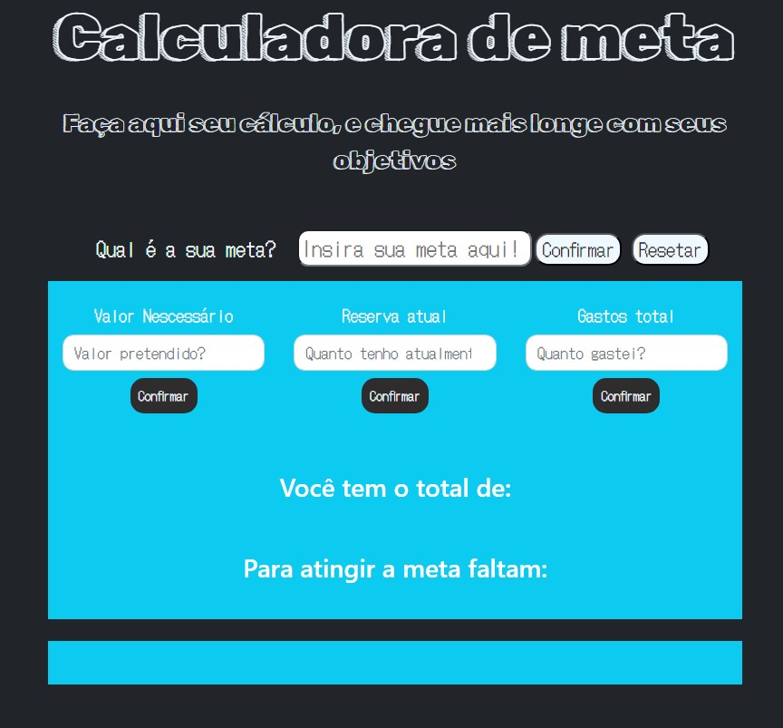

# Calculadora de meta
## Um pequeno WebApp com objetivo didático, para aprimorar alguns conceitos.
### Descrição:
Desenvolvi um WebApp educativo usando HTML, CSS, Bootstrap e JavaScript, oferecendo uma abordagem única para além das calculadoras convencionais. A "Calculadora de Meta" é projetada para aprimorar habilidades, destacando lógica condicional simultânea, integração harmoniosa com classes do Bootstrap e coesão entre tecnologias.

### Principais Conceitos Aprimorados:

🧠 Uso avançado de lógicas e condicionais. 
🎨 Integração fluída das classes do Bootstrap. 
🤝 Coerência entre as tecnologias utilizadas. 

### Funcionalidades Destacadas:

🎯 Defina sua Meta: Estabeleça objetivos claros para seus projetos. 
📊 Acompanhe Seu Progresso: Visualize seu objetivo, calculando o valor necessário versus sua reserva atual. 
💬 Receba Incentivos Personalizados: Mensagens motivacionais com base no seu progresso. 

### Propósito Único:
Esta calculadora vai além do trivial, focando em metas e progresso financeiro. Utilizando dados inseridos, ela calcula seu caixa total, a diferença em relação à meta e fornece mensagens motivacionais com base no progresso.
Explore e contribua para este projeto!
